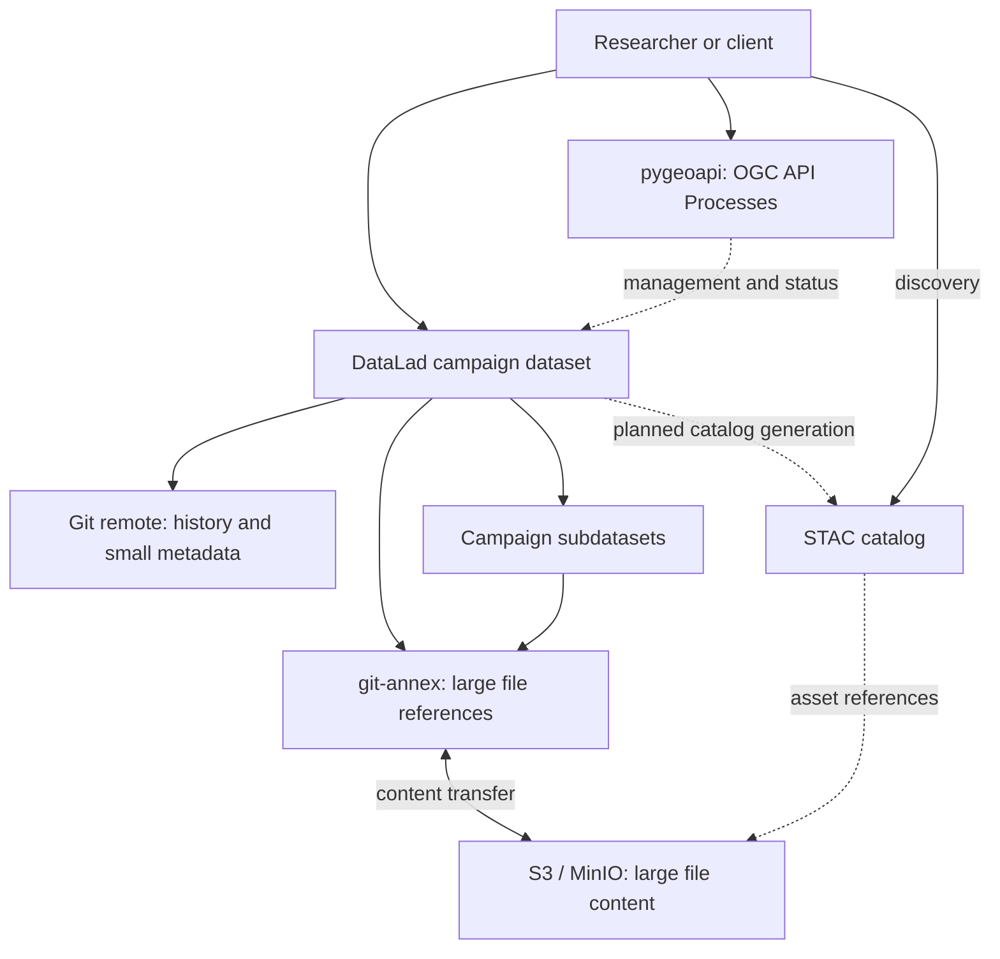

# Proposed architecture

**Status: planned.** The diagram describes intended integrations, not running services.



## DataLad datasets and subdatasets

- Use one parent dataset per campaign, with subdatasets by instrument or product.
- The parent records each subdataset's Git revision, allowing a campaign snapshot.
- Git stores history and small text metadata. git-annex manages large file content.
- Retrieve selected content on demand. Record processing commands, inputs and outputs
  using DataLad provenance facilities when workflows are added.

Illustrative layout only:

```text
campaign/
├── README.md
├── instruments/
│   ├── radar/        # subdataset
│   └── radiometer/   # subdataset
└── products/         # subdataset
```

See [DataLad documentation](https://docs.datalad.org/en/stable/) and
[`datalad run`](https://docs.datalad.org/en/stable/generated/man/datalad-run.html).

## S3 / MinIO storage

- Evaluate a git-annex S3 special remote for file content and MinIO as an S3-compatible endpoint.
- Publish Git history separately. An annex content remote does not replace a Git remote.
- Keep credentials outside Git and outside published catalogs.
- Test retrieval, integrity checks and recovery before allowing local content removal.
- Decide bucket policies, retention and object addressing during the storage increment.

Reference: [git-annex S3 remote](https://git-annex.branchable.com/special_remotes/S3/).

## STAC metadata and discovery

- Begin with a static catalog using standard STAC Collections and Items.
- Describe spatial and temporal coverage and link assets to retrievable content.
- Determine how an Item identifies a dataset revision and resolves an asset URL.
- Do not assume an annex object key is a public asset URL. Authentication and URL
  lifetime need an explicit design.
- Consider a STAC API only if the static catalog cannot meet discovery needs.

Reference: [STAC specification](https://stacspec.org/en/about/stac-spec/).

## pygeoapi operations

- Add small process plugins around independently usable management functions.
- Candidate operations: register a campaign, check content availability, refresh a catalog.
- Expose execution results and job status through OGC API Processes.
- Select a process manager for asynchronous jobs if needed. Job status alone does
  not provide continuous storage monitoring.

Reference: [pygeoapi processes](https://docs.pygeoapi.io/en/stable/publishing/ogcapi-processes.html).
